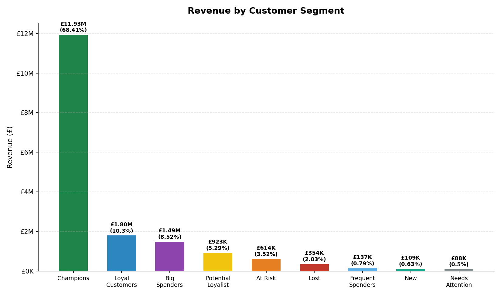
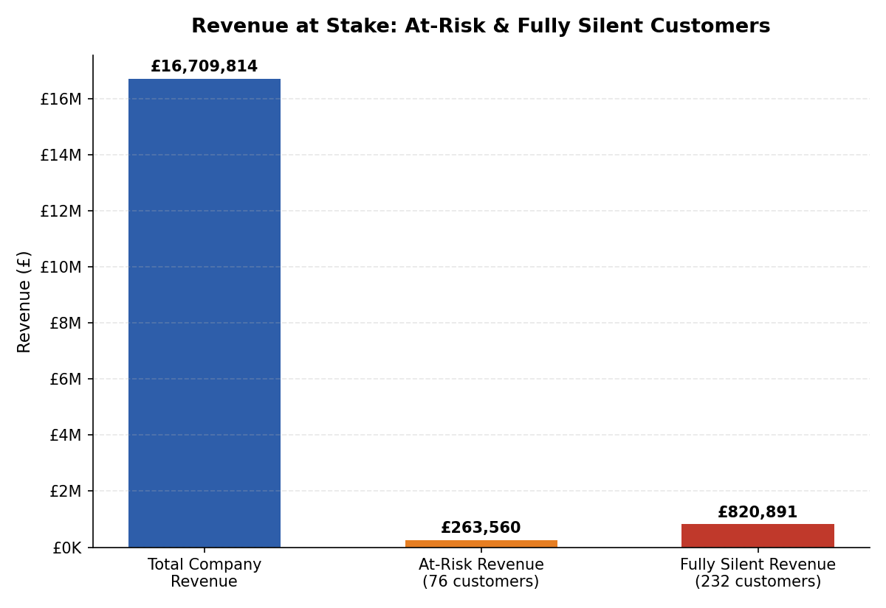
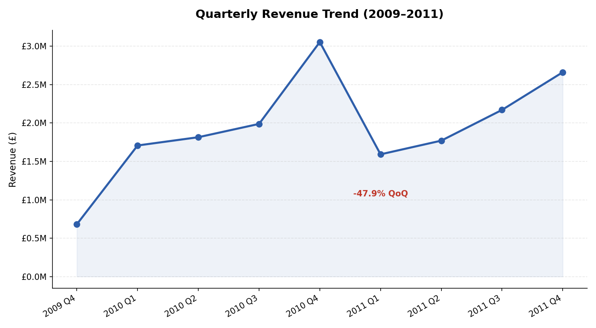

# Customer Segmentation & Churn Analysis — Online Retail

SQL portfolio project analyzing customer behavior, revenue concentration, and churn using RFM (Recency, Frequency, Monetary) analysis on the UCI Online Retail II dataset.

---

## Business Question

> "Our online retail revenue has been inconsistent, and I'm worried we're losing good customers without noticing. I need to understand who our best customers are, who's at risk of leaving, and what we should actually do about it before next quarter."

---

## Key Results

- Identified 9 customer segments using RFM analysis
- Champions generated 68.41% of total revenue
- Detected 76 high-value customers showing churn signals
- Quantified £263,559.73 immediate revenue retention opportunity
- Identified £1.08M total historical revenue exposure from churn groups
- Confirmed churn was not caused by product availability or pricing changes

---

## Key Findings & Business Impact

### Who Are Our Best Customers?
- **Champions** and **Loyal Customers** — highest across recency, frequency, and monetary value
- **Top 20 customers** by revenue generate **£3,815,486.59** — **21.88%** of total company revenue

**Full segment breakdown — revenue by segment:**

| Segment | Customers | Revenue | % of Total |
|---|---|---|---|
| Champions | 1,299 | £11,930,519.42 | 68.41% |
| Loyal Customers | 558 | £1,795,401.58 | 10.30% |
| Big Spenders | 546 | £1,486,432.35 | 8.52% |
| Potential Loyalist | 1,041 | £923,273.51 | 5.29% |
| At Risk | 74 | £614,113.04 | 3.52% |
| Lost | 1,358 | £354,343.49 | 2.03% |
| Frequent Spenders | 321 | £137,490.80 | 0.79% |
| New | 364 | £109,344.91 | 0.63% |
| Needs Attention | 303 | £88,041.20 | 0.50% |



### Who Is At Risk?
- **76 customers** flagged as at-risk: historically high-value, but activity collapsed in the most recent 3 months. Revenue at stake: **£263,559.73 (1.58% of total revenue)**
- **232 customers** went completely silent (zero recent activity), representing an additional **£820,890.66** in past revenue
- Root-cause analysis ruled out product discontinuation and pricing changes — this is **genuine customer churn**, not a catalog or pricing issue
- Decline is broad-based across nearly every country (65–85% drop), including the UK, our largest market (-75.30%)
- Cancellation rates for at-risk customers roughly doubled (2.29% → 4.62%) — a secondary warning signal



### Revenue Trend Over Time
Revenue grew steadily from 2009 Q4 through 2010 Q4, dropped sharply in 2011 Q1 (-47.87%), then recovered through the rest of 2011 — an overall long-term growth pattern with one notable anomaly.



### What Should We Do?
| Segment | Action |
|---|---|
| Champions | Protect and reward — loyalty perks, VIP treatment |
| Loyal Customers | Marketing to increase frequency/spend toward Champion status |
| Big Spenders | Offer premium products, encourage frequency |
| Potential Loyalist | Engagement campaigns to build purchase consistency and recency |
| Frequent Spenders | Encourage higher basket value through bundling or upsell offers |
| New | High-priority nurture — strong onboarding and early incentives |
| Needs Attention | Immediate engagement — one step from At Risk |
| At Risk | Direct outreach and competitive analysis (not price/product changes — ruled out as causes) |
| Lost | Not a recovery priority — use as a pattern to catch early warning signs elsewhere |

**Revenue impact:** Retaining the 76 at-risk customers would **preserve £263,559.73** (1.58% of total revenue) that would otherwise be lost. Including the fully-silent tier, total revenue exposure across both churn groups is **£1,084,450.39**.

Full detail: see [`Q10_final_summary.md`](./Q10_final_summary.md) and [`findings.md`](./findings.md).

---

## Skills Demonstrated

`SQL` · `PostgreSQL` · `Window Functions (NTILE, RANK, LAG)` · `CTEs & Subqueries` · `RFM Analysis` · `Customer Segmentation` · `Churn Analysis` · `Data Cleaning` · `Business Analytics` · `Root-Cause Investigation` · `Data Visualization`

---

## Dataset

- **Source:** UCI Online Retail II — real UK-based online retail transactions, Dec 2009–Dec 2011
- **Size:** ~1,067,371 raw transaction rows across two years
- **Tools:** PostgreSQL, pgAdmin

---

## Methodology

1. **Data cleaning and validation** — cast types, standardize stock codes/descriptions/country labels, flag transaction type, and exclude non-product/administrative rows. See `01_cleaning.sql`.
2. **RFM scoring** — calculate Recency, Frequency, and Monetary values per customer, then rank into 1–5 scores using `NTILE(5)`. See `02_rfm_segmentation.sql`.
3. **Customer segmentation** — label each customer into one of nine business segments (Champions, Loyal Customers, Big Spenders, Frequent Spenders, Potential Loyalist, At Risk, Lost, New, Needs Attention) based on RFM scores.
4. **Business analysis** — answer 9 analytical questions plus a final recommendation synthesis, using the cleaned and segmented data. See `03_analysis_questions.sql` and `findings.md`.
5. **Recommendations** — translate findings into segment-level actions and quantify the revenue impact of retention. See `Q10_final_summary.md`.

---

## Project Structure

```
customer-segmentation-analysis/
│
├── 01_cleaning.sql
├── 02_rfm_segmentation.sql
├── 03_analysis_questions.sql
│
├── findings.md
├── Q10_final_summary.md
├── README.md
│
├── revenue_by_segment.png
├── quarterly_revenue_trend.png
└── at_risk_revenue.png
```

---

## Project Workflow

```
Raw CSV (UCI Online Retail II)
        ↓
   Data Cleaning        →  01_cleaning.sql
        ↓
   RFM Scoring           →  02_rfm_segmentation.sql
        ↓
   Segmentation (9 segments)
        ↓
   Business Analysis (9 sub-questions)  →  03_analysis_questions.sql
        ↓
   Findings & Interpretation  →  findings.md
        ↓
   Recommendations & Revenue Impact  →  Q10_final_summary.md
```

---

## Repository Structure (File Reference)

| File | Contents |
|---|---|
| [`01_cleaning.sql`](./01_cleaning.sql) | Raw data cleaning logic, with documented decisions |
| [`02_rfm_segmentation.sql`](./02_rfm_segmentation.sql) | RFM scoring and customer segmentation |
| [`03_analysis_questions.sql`](./03_analysis_questions.sql) | All 9 analytical sub-questions, one section each |
| [`findings.md`](./findings.md) | Question-by-question results and interpretations |
| [`Q10_final_summary.md`](./Q10_final_summary.md) | Executive summary, segment recommendations, revenue impact |
| [`revenue_by_segment.png`](./revenue_by_segment.png) | Chart — revenue distribution across all 9 customer segments |
| [`quarterly_revenue_trend.png`](./quarterly_revenue_trend.png) | Chart — quarterly revenue trend, 2009–2011 |
| [`at_risk_revenue.png`](./at_risk_revenue.png) | Chart — revenue exposure from at-risk and fully silent customers |

---

## Key Decisions & Data Quality Notes

- `online_retail_raw` is never modified — all cleaning happens in `online_retail_cleaned`
- Transaction type flagged as: `cancellation` (C-prefix invoices), `adjustment` (A-prefix invoices), `inventory_adjustment` (negative quantity), `normal` (standard sale)
- Non-product administrative stock codes (postage, bank charges, manual entries) excluded
- `EIRE` relabeled to `Ireland`; `Unspecified` and `European Community` retained as-is (small share of revenue, non-standard placeholder labels in the source data)
- At-risk customers defined using a fresh past-vs-recent 3-month comparison (not reused from the whole-dataset RFM snapshot), for a more precise churn signal
